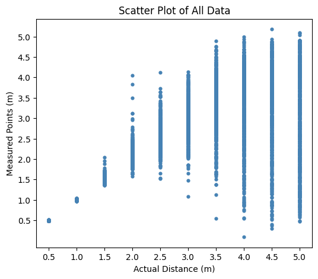
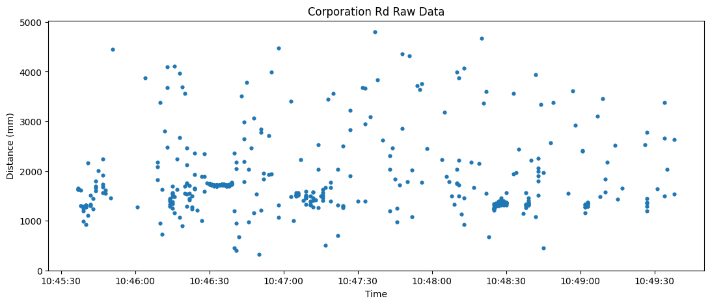
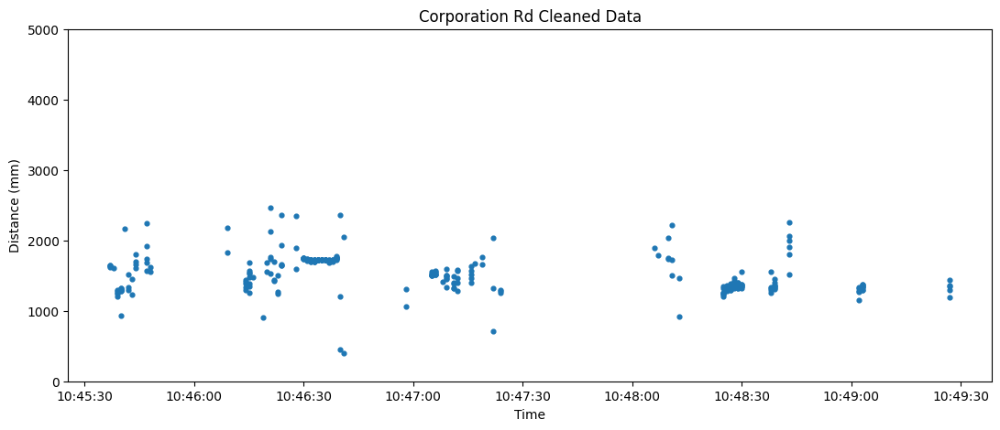

# Traffic Data Collection

## Project Overview

### Context

In Singapore, in the face of bicycle related traffic accidents, traffic rules require cars to overtake bicycles at a minimum distance of 1.5m.

### Objective

The goal of this project is to collect data on the passing distance of cars to bicycles, as reliable data on this subject of study does not exist. I used two different sensors - a Time of Flight (TOF), and a laser distance sensor to measure the distance of passing vehicles. The sensors were mounted a bike which was used to ride around Singapore roads and collect data.

## Data Analysis

I analyze the results of each test in a separate Jupyter Notebook.

- [TOF Sensor Basic Tests](./data_analysis/TOF_Basic_Tests.ipynb)
- [TOF Sensor Outdoor Tests](./data_analysis/TOF_Outdoor_Tests.ipynb)
- [Laser Sensor Basic Tests](./data_analysis/Laser_Basic_Tests.ipynb)
- [Laser Sensor Outdoor Tests](./data_analysis/Laser_Outdoor_Tests.ipynb)

## Sensor Setup

1. Sensors Used
2. Default Software Setup
3. Using the Sensors with Raspberry Pi
4. Casing Design

### Sensors Used

- [TOF Laser Range Sensor by WaveShare](https://www.waveshare.com/tof-laser-range-sensor.htm)
- [Laser Distance Sensor by Chengdu JRT Meter Technology Co. Ltd](https://www.alibaba.com/product-detail/Laser-Distance-Measuring-Device-100m-Chip_1600877291661.html?spm=a2700.shop_plgr.41413.11.4f9474e2pi4SXS)

### Default Software Setup

- Both the TOF and laser sensors came with their default software for Windows. The [TOF sensor's software](https://www.waveshare.com/wiki/File:Waveshare_TOFAssistant.zip) was found on its [documentation page](https://www.waveshare.com/wiki/TOF_Laser_Range_Sensor). However, the software and documentation of the laser sensor was only provided directly by the manufacturer.
- Before using the software, I needed to the necessary [CP210x USB to UART drivers](https://www.silabs.com/developers/usb-to-uart-bridge-vcp-drivers?tab=downloads).
- To connect the TOF sensor to my laptop, I had to purchase a USB to TTL adaptor. The laser sensor came with one pre-installed.
- In addition, for the software to recognize the sensor, I needed to identify which COM port they were connected to. To do this, I needed to activate COM Ports in the Windows device manager by going to: Actions &rarr; Add Legacy Hardware &rarr; And installing Ports (COM & LPT).
- I did not have to adjust the baudrate on the software for the TOF sensor. However, I had to set the baudrate for the laser sensor to 115200bps for it to work with the software.
- Once the software was set up, I could test the sensors to determine that they were working.

### Using the Sensors with Raspberry Pi

To have the sensors collect data while attached to a bike, I needed to attach them to a Raspberry Pi and run a script. Setting this up consisted of 3 parts:

1. Enabling Serial Port Settings.
2. Communicating with the sensors via Python.
3. Publishing the data collected to MQTT.
4. Auto-starting the script on boot.

#### Enabling Serial Port Settings

- To begin using the sensors, I needed to first enable the Raspberry Pi's serial port settings to allow for communication with the sensors using the following command.

    ```bash
    sudo raspi-config
    ```

- Following the prompts:
  - Would you like a login shell to be accessible over serial? &rarr; No
  - Would you like serial port hardware to be enabled &rarr; Yes

- Next, I opened the `/boot/config.txt` file and included the following configuration line to the end of the file.

    ```text
    enable_uart=1
    ```

- After this, I rebooted the computer.

#### Communicating with the Sensors via Python

- Both sensors work by writing and reading bytes to their respective serial ports, which can be extracted and used to find the distance the sensor's measure.
- The [`pyserial`](https://pypi.org/project/pyserial/) module allows communication with serial ports, which in turn allowed me to communicate with the sensors.

    ```bash
    pip install pyserial
    ```

- First, I needed to create a new `serial.Serial()` object and define the correct ports and baudrate. I was stuck for days, but eventually, I realised the TOF and laser sensors needed a baudrate of **921600** and **115200** respectively.

    ```python
    tof_ser = serial.Serial("/dev/ttyS0", 921600)
    laser_ser = serial.Serial("/dev/ttyUSB0", 115200)
    ```

- Next, the sensor would write data to the ports in the form of protcols, which are a string of hexadecimal bytes. The WaveShare documentation gives an example protcol as below.

    ```text
    57 00 ff 00 9e 8f 00 00 ad 08 00 00 03 00 ff 3a
    ```

- The laser sensor contains more functionality and can have different outputs. Therefore, it requires a command to be sent in the form of a hex string representing different bytes. For example, to read distance one time, we send this command using the `Serial.write()` command.

    ```python
    laser_ser.write(b"\xaa\x00\x00\x20\x00\x01\x00\x00\x21")
    ```

- Once the sensors are running and writing data to the serial port, to extract this information and find the distances measured, we need to read the protocol using the `Serial.read(number_of_bytes_to_read)` command. Protocols can differ in length and I had to specify the number of bytes to read from the serial port.

    ```python
    # Reading from the serial port will give a binary hex string like b"\x57\x00\xff" etc.
    protocol = tof_ser.read(16)

    # Using a list comprehension, we can vert it to a list of decimal values
    # representing the respective bytes like [87, 0, 255] etc.
    protocol = [byte for byte in protocol]
    ```

- After reading the protocol, we need to check if it is valid. For both sensors, the last byte of every protocol is a *sum check*. For instance, for the TOF sensor, the sum of all other must equal to the sum check for the protocol to be considered valid and have no errors. We also need to take the modulo of the sum of the bytes because the sum may exceed 256 which is the maximum value for a single byte.

    ```python
    if sum(protocol[:-1]) % 256 == protocol[-1]:
        print("Protocol is valid!")
    ```

- Next, to find useful values like distance, we extract the relevant bytes, convert them back into hex and combine them into a hex string, and convert the hex string into its decimal representation. For instance in the protcol above for the TOF sensor, distance is represented by the bytes in indices 8 to 10 in reverse order.
- This conversion can be found in the `Sensor._to_hex()` and `Sensor._to_hex_string()` in my sensor module.

    ```python
    distance_bytes = protocol[10:7:-1]
    hex_bytes = []

    for byte in distance_bytes:
        # hex(00) -> "\x00"
        # "\x0"[2:] -> "0"
        # "0".zfill(2) -> "00"
        hex_bytes.append(hex(byte)[2:].zfill(2))

    hex_string = "".join(hex_bytes)
    distance = int(hex_string, base=16)
    ```

- Sometimes, the sensor will be unable to measure distance and output an invalid protocol. I found that once this happened, the whole script would break and the sensor seemed unable to measure anymore. I realized that this was because the invalid protocol was never cleared from the input buffer, thereby making any subsequent protocols invalid. All I had to do was clear the input buffer.

    ```python
    ser.flush_input_buffer()
    ```

- I created a base `Sensor` class in [`sensor.py`](./sensor/sensor.py) which has helper methods to read from the sensor and extract relevant bytes from the different protcols. The modules [`tof_sensor.py`](./sensor/tof_sensor.py) and [`laser_sensor.py`](./sensor/laser_sensor.py) inherit from the `Sensor` class and contain methods to use the sensor to measure distances of the TOF and laser sensor respectively based on their different requirements.

#### Publishing to MQTT

- I could now run a Python script to continuously collect data from the sensor. However, it would be good if I could see the data being collected in real time instead of having to to wait for collection to finish before extracting the data from the Raspberry Pi.
- I registered my Raspberry Pi for AWS IoT core and downloaded the AWS IoT Device Python SDK, which contained the necessary certificates that allowed Python scripts to access the AWS IoT platform through MQTT. Essentially, I could send data from the Raspberry Pi over AWS and collect in on my laptop in real time.
- First, I created a [`Publisher()`](./sensor/publish.py) class which contained all the functionality needed to publish data from the Raspberry Pi over to AWS.
- Next, I created a [`subscribe`](./sensor/subscribe.py) script meant to be run on my laptop to view the data in real time. It uses [`paho-mqtt`](https://pypi.org/project/paho-mqtt/) "which enable applications to connect to an MQTT broker to publish messages, and to subscribe to topics and receive published messages".

#### Autostart

- Finally I wrote a main script which collected data and published it to AWS. I needed this script to autostart once the Raspberry Pi booted. For this, I created and enabled a systemd service. The format of the script can be found [here](./sensor/raspberry_pi_autostart/tof_sensor.service).
- I activated the service by running the following commands in the terminal.

    ```bash
    sudo systemctl daemon-reload
    sudo systemctl enable SERVICE_NAME.service
    ```

- From here, I could troubleshoot if the autostart wasn't working by running by viewing the status of the service.

    ```bash
    sudo systemctl status SERVICE_NAME.service
    ```

- At first, the autostart didn't seem to work no matter what I tried. I finally found that the solution was to have my script wait until an internet connection was established before attempting to establish a connection with MQTT. This was because the Raspberry Pi needed time to connect to the internet and would throw an error if it tried to connect to MQTT when there was no internet.

### Casing Design

After dealing with the software part of things, I needed to design a physical setup to mount on the bicycle. The designs can be found [here](./casing_designs/). I decided to use [Decathlon's Universal Smartphone Bike Mount](https://www.decathlon.sg/p/universal-adhesive-garmin-adapter-for-smartphones-triban-8500817.html) to attach the sensor.

#### TOF Sensor Frame/Case

- In SolidWorks, I designed a simple frame which I could screw the sensor on. The flat surface of the frame was where I stuck on the bike mount.

    

- After some outdoors testing, I realized that the sensor was extremely unreliable when exposed to sunlight. I proceeded to design a shade for the frame to mitigate the collection of missearnt data.

    
    

- I finally settled on a design which provided enough shade to mitigate the collection of misserant data, but was also compact enough to prevent interference with pedaling the bike.

    
    

#### Laser Sensor Frame

- Because the laser sensor's reliability wasn't very affected by light, I did not design a shade and stuck with a simple frame.

    

## Code

A secondary objective I had for this project was to keep my code clean and modular. This was not only to maintain the integrity of my code, but to train myself to write code in a disciplined manner.

I definitely felt that at some points, this level of modularization was unnecessary and a little redundant. However, as someone not used to writing clean code, I took this upon myself as a learning experience.

### Data Analysis Code

While creating my Jupyter Notebooks to display the data collected, I quickly ran into the problem of having my notebooks fill up with huge chunks of auxilliary code unrelated to the data analysis. As a result, I decided to split the auxilliary code into separate modules, and import them when needed. This kept the code in my Notebooks minimal and allowed the focus to remain on the data analysis. I will be describing the functions and challenges of each module.

#### [`format_data.py`](./data_analysis/format_data.py)

One of the biggest difficulties in keeping my code modular was dealing with the different ways the data collected was formatted. For instance, the code extracted from the WaveShare's software was found in an excel file, whereas when I used a Raspberry Pi, I had the data output to a text file. Therefore, I needed a fixed format in which the data was stored, so I could extract every file of data using the same function, instead of creating a new function for every new format. The auxilliary functions in `format_data.py` would go through all the raw data, and format them to fit a specific format, and write them to new text files.

#### [`data.py`](./data_analysis/data.py)

Once I had a fix format which all the data was stored, I needed a way to easily extract the data. I hated to see my Notebooks cluttered with ugly code to in the process of extracting the data. `data.py` contains two classes: `FolderData`, which is concerned with storing the data from folders and `DataLoader` which helps to extract the data from files and folders.

For example, if I wanted to extract an entire folder of distance measurements for each distance interval, I would use `FolderData`.

```python
from data import FolderData

data = FolderData(PATH_TO_FOLDER)
distances = data.distances
```

Or, if I wanted to extract data from a file only, I would use `DataLoader`.

```python
from data import DataLoader

data_loader = DataLoader()
timings, distances, signal_strengths = data_loader.load_data_from_file(PATH_TO_FILE)
```

#### [`graphing.py`](./data_analysis/graphing.py)

For both the TOF and laser sensor, I wanted to plot the same graphs many times for comparison and analysis. Thus, it only made sense to create a module with resuable code to do this. The module contains two class: `BasicGraphs` which is for plotting the graphs for the basic, stationary tests, and `OutdoorGraphs`, which plots the data for the cycling tests.

For example, if I wanted to plot a scatter plot of all the distances measured for a stationary test, I would use the `plot_scatter` method of `BasicGraphs`.

```python
import matplotlib.pyplot as plt

from data import FolderData
from graphing import BasicGraphs

graphs = BasicGraphs()
data = FolderData(PATH_TO_FOLDER)

fig, ax = plt.subplots(figsize=(6, 5))
graphs.plot_scatter(ax, data.distances, title="Scatter Plot of All Data")
```



Or, after I collected a list of points from cycling on the road and wanted to plot a scatter, I would use the `scatter_time_vs_distance` method of `OutdoorGraphs`.

```python
import matplotlib.pyplot as plt

from data import DataLoader
from graphing import BasicGraphs

graphs = OutdoorGraphs()
data_loader = DataLoader()
timing, distance, signal_strength = data_loader.load_data_from_file(PATH_TO_FILE)

fig, ax = plt.subplots(figsize=(13, 5))
graphs.scatter_time_vs_distance(ax, timing, distance, title="Scatter Plot of Time vs Distance")
```



#### [`preprocessing.py`](./data_analysis/preprocessing.py)

Finally, the preprocessing module handles the processing of data. It also contains two modules. `DataCleaner` focuses on cleaning the spurious data produced by the sensors to help making distance measuring and vehicle detection more reliable. `DataProcessor` might be unnecessary, but in the spirit of trying to keep my code very tight and modular, I included here helper functions to get the mean and standard deviations of lists of data.

For example, if I were to clean the previous scatter graph, I would use the `clean_spurious_data` method of `DataCleaner`.

```python
from preprocessing import DataCleaner

data_cleaner = DataCleaner()
cleaned_distances = data_cleaner.clean_spurious_data(distances)
```



### Raspberry Pi Code

The code for the Raspberry Pi consisted of 3 parts: interacting with the sensors, publishing the data, and other auxilliary code.

#### Sensor Code

Both the TOF and laser sensors could be communicated with via serial ports in very similar ways. Therefore, I split the code for the sensors into 3 modules. First, I created a base class [`sensor.py`](./sensor/sensor.py) which housed the `Sensor` class to be inherited from. The sensor class contained the basic methods used by both TOF and laser sensors to read and process protocols.

[`laser_sensor.py`](./sensor/laser_sensor.py) and [`tof_sensor.py`](./sensor/tof_sensor.py) contain the classes `LaserSensor` and `TOFSensor` respectively, which inherit from `Sensor`. Both of these classes could be used interchangably to interact with whichever sensor was needed.

#### Publishing Code

I also needed to publish my data via MQTT to AWS. Instead of building in the publishing feature within each sensor module, I created a [`publish.py`](./sensor/publish.py) which did this indpenedently. [`constants.py`](./sensor/constants.py) contained the constants needed to initialize the `Publisher` module. I could then combine the sensor and publishing object in a very clean way like so.

```python
from laser_sensor import LaserSensor
from publish import Publisher

sensor = LaserSensor()
publisher = Publisher()

data = sensor.get_data()
publisher.publish(data)
```

I also have a [`subscribe.py`](./sensor/subscribe.py) module meant to be run on another computer. This script would help to receive the data in real time that is being published.

#### Auxilliary Code

Finally, I created some auxilliary functions in [`utils.py`](./sensor/utils.py). The most significant one would be `wait_for_internet`, which would ensure a successful connection via MQTT.
