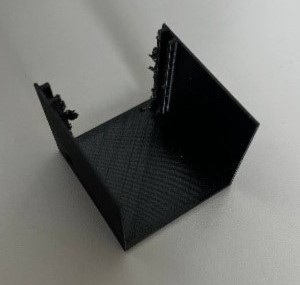

# TOF Sensor Data Collection

## Project Overview

### Context

In Singapore, in the face of bicycle related traffic accidents, traffic rules require cars to overtake bicycles at a minimum distance of 1.5m.

### Objective

The goal of this project is to collect data on the passing distance of cars to bicycles, as reliable data on this subject of study does not exist. I use a Time of Flight (TOF) to collect the data, which uses infrared technology to measure distance accurately. The sensor is mounted a bike which is used to ride around Singapore roads, collecting data which can be further analyzed.

## [Basic Tests](./data_analysis/Basic_Tests.ipynb)

1. Setup
2. Testing Procedure
3. Raspberry Pi Setup
4. Casing Design

### Software Setup

- The first objective was to test the standalone distance measuring capabilities of the sensor.
- To set it up on Windows, I first installed the [software](https://www.waveshare.com/wiki/File:Waveshare_TOFAssistant.zip) from the [documentation](https://www.waveshare.com/wiki/TOF_Laser_Range_Sensor).
- I then purchased a USB to TTL adaptor to connect the sensor to my Windows laptop.
- For the sensor to work, I needed to install the [CP210x USB to UART drivers](https://www.silabs.com/developers/usb-to-uart-bridge-vcp-drivers?tab=downloads).

### Testing Procedure

- Using the software provided, I tested the distance measuring capabilities of the sensor at intervals of 0.5 meters, from 0.5 meters to 5.0 meters.
- I quickly realized that the sensor would lose a lot of it's accuracy in bright daylight.
- The default software allowed me to export the data in an excel file format, which I proceeded to extract the data from and graph using Matplotlib.

### Raspberry Pi Setup

#### TOF Sensor Python API

- To run the sensor on a Raspberry Pi, I downloaded the [demo code](https://www.waveshare.com/wiki/TOF_Laser_Range_Sensor#Resources) provided by the documentation, and enabled to necessary [serial port settings](https://www.waveshare.com/wiki/TOF_Laser_Range_Sensor#Working_with_Raspberry_Pi).
- Unfortunately, the code didn't work, and with a lack of Python API documentation, I was stuck. After a few days of trial error I found the solution which lay in this line of code:

    ```python
    ser = serial.Serial("/dev/ttyS0", 921600)
    ```

- This line of code was needed to enable UART communication between the sensor and Raspberry Pi.
- Essentially, I needed to read the data from the sensor using [pyserial](https://github.com/pyserial/pyserial/). For example:

    ```python
    import serial

    ser = serial.Serial("/dev/ttyS0", 921600)
    protocol = []

    for _ in range(16):
        protocol.append(ord(ser.read(1)))
    ```

- Once done, the data would be organized in the form of a [*protocol*](https://www.waveshare.com/wiki/TOF_Laser_Range_Sensor#Protocol_analysis) consisting of 16 bytes which I needed to read the distance and other relevant measurements from. In my code, the protocol was a list where each index represented each byte of data. Here is the structure of a protocol:

    > Frame Header (3 bytes) + ID (1 Byte) + System Time (4 Bytes) + Distance (3 Bytes) + Signal Strength (2 Bytes) + Reserved? (1 Byte) + Sum Check (1 Byte)

- For example, to extract distance:

    ```python
    # Distance information is found in indices 8 to 10 of the protocol.
    distance = protocol[8] | (protocol[9] << 8) | (protocol[10] << 16)
    ```

- The demo code cleaned and modularized it into a [`Sensor()`](./tof_sensor/sensor.py) class.
- However, the protocol is sometimes corrupted and the sensor is unable to output useful information. I still don't know the cause of this and how to prevent it.

#### Publishing to MQTT

- Next, I wanted a way to see the data on the fly as it was being collected, and not have to wait for collection to finish before extracting the data from the Raspberry Pi.
- I registered my Raspberry Pi for AWS IoT core, and allowed it to publish data via MQTT. I could then subscribe to the MQTT topic on my laptop, and see the data as it was being collected in real time. For this, I created a [`Publisher()`](./tof_sensor/publish.py) class and a [`subscribe`](./tof_sensor/subscribe.py) script.

#### Autostart

- Finally, I needed the script to autostart on boot. I wrote a [`main.py`](./tof_sensor/main.py) script which continuously collected and published data. I used a [systemd service](./tof_sensor/raspberry_pi_autostart/tof_sensor.service) to autostart my script on the Raspberry Pi.
- At first, the autostart didn't seem to work no matter what I tried. I finally found that the solution was to have my script sleep for at least 20 seconds before attempt to establish a connection with MQTT. This was because the Raspberry Pi took a while to connect to the internet.

### Casing Design

- After dealing with the software part of things, I needed to design a physical setup to mount on the bicycle. The designs can be found [here](./casing_designs/).
- I decided to use [Decathlon's Universal Smartphone Bike Mount](https://www.decathlon.sg/p/universal-adhesive-garmin-adapter-for-smartphones-triban-8500817.html) to attach the sensor.
- In SolidWorks, I designed a simple frame which I could screw the sensor on. The flat surface of the frame was where I stuck on the bike mount.

    

- After some outdoors testing, I realized that the sensor was extremely unreliable when exposed to sunlight. I proceeded to design a shade for the frame to mitigate the collection of missearnt data.

    
    

- I finally settled on a design which provided enough shade to mitigate the collection of misserant data, but was also compact enough to prevent interference with pedaling the bike.

    
    

## Simple Outdoors Tests

## [Cycling Tests](./data_analysis/Cycling_Tests.ipynb)
